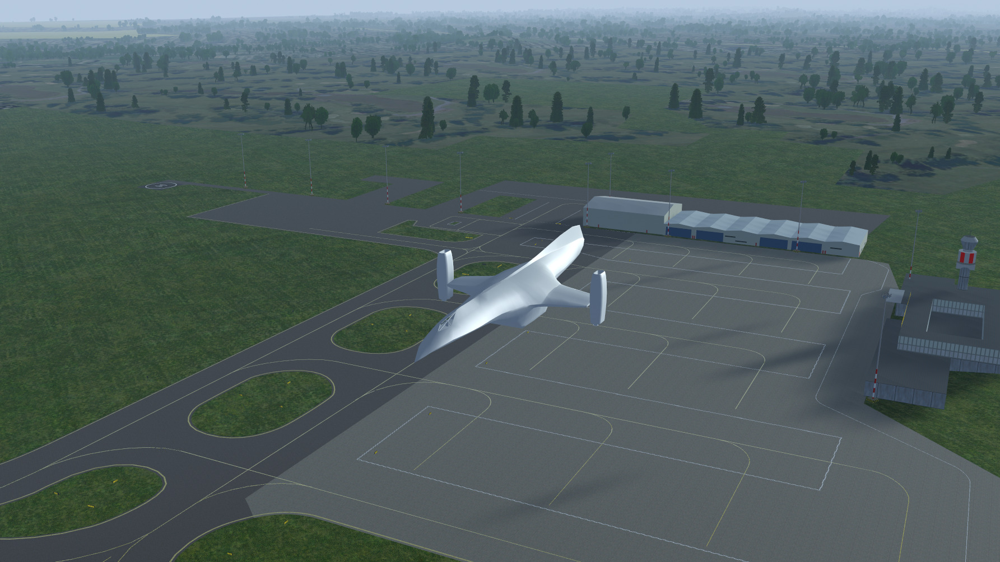

SB46-03 Sparklebug
=================

This is a fictional transport spacecraft; any similarity with real or fictional
aircraft or spacecraft is accidental and completely unintentional.

Characteristics
---------------

The Sparklebug is a single-stage-to-orbit (SSTO), vertical takeoff/landing
(VTOL) transport spacecraft.

It is equipped with the following propulsion systems:

- Air-breathing main engines (4, though only 2 currently simulated), mounted in
  two rotating nacelles on the wing tips.
- Rocket engine (3, though only 1 currently simulated), mounted in the tail.
- 12 RCS thrusters.

A typical mission would involve the following flight phases:

- Vertical takeoff
- Accelerate to subsonic climb speed, main engines provide lift and thrust
- At a suitable altitude, engage afterburners, tilt main engines forward,
  and go supersonic. Wings now provide sufficient lift for sustained
  aerodynamic flight.
- Supersonic climb to upper atmosphere.
- Engage rocket engine to continue climb and acceleration
- Main engine shutoff around 100k ft
- Orbital insertion using rocket engine and RCS
- Deorbit burn using rocket engine
- Ballistic descent to upper atmosphere; pitch up ~40 degrees for optimal drag
- Main engines started once air density is sufficient, pointed down to further
  decrease speed
- Transition to aerodynamic flight, glide down to a suitable atmospheric cruise
  altitude and speed
- Approach destination in aerodynamic flight
- Vertical landing

Flying the Sparklebug
---------------------

### The FBW System

Each axis (pitch, bank, yaw) has its own separate FBW law; laws can be cycled
with the q, w, and e keys (q = pitch, w = bank, e = yaw). The FBW automatically
maps bank and yaw to the RCS and main engine pitch difference: when the engines
are pitched full-forward, the bank axis controls engine pitch, when they are
pointing up in a hover position, the yaw axis controls engine pitch, and for
in-between positions, *both* axes influence engine pitch. In all cases, the RCS
system is used to compensate for missing rotational momentum on either axis.

The **available FBW laws** are:

- **Direct Law (0)**. Control inputs (stick / pedals) control engine pitch and
  RCS thrusters directly.
- **Rate Law (1)**. Control inputs command target rotation rate. Neutral
  controls will attempt to hold current attitude; stick or pedal deflections
  command a constant rate of rotation.
- **Attitude Law (2)** (pitch and bank axes only). Control inputs command
  target attitude. Neutral controls will attempt to put the aircraft in a
  neutral position relative to the ground (zero pitch / zero bank).
- **Yaw Damper Law (2)** (yaw axis only). Control inputs command side slip.
  Neutral rudder will attempt to eliminate sideslip; this means that the
  aircraft will fly much like a conventional fixed-wing craft, and respond to
  banking by turning.

**Engine Pitch** is controlled by the propeller pitch input. As a shortcut,
pressing *Shift-H* will command a straigh-up pitch. The engine pitch commanded
this way (prop pitch / Shift-H) is only the *base* pitch; yaw and or bank
commands may add *differential* engine pitch to that.

### Propulsion

Engine startup is currently best done via the Autostart menu item. This will
start the main engines; it's best to put them into a straight-up position
before starting (*Shift-H*), to avoid toppling the aircraft over.

About 50% thrust should be enough to achieve a gentle vertical climb. At 95%
thrust, the afterburners kick in; you will probably need these to achieve
supersonic speeds.

The rocket engine ("stardrive") can be turned on and off using the *S* key.
This engine produces a massive amount of thrust, however realistically (for
what that means for a fictional spacecraft like this) you would not use it
below 60,000 ft.

### Recommended procedures

#### Startup

- Pitch Law: ATTITUDE (2)
- Bank Law: ATTITUDE (2)
- Yaw Law: RATE (1)
- Main Engine Pitch: UP
- Throttles: IDLE
- Wind: CHECKED
- Autostart: SELECTED
- Left Engine N2: STABLE 35%
- Right Engine N2: STABLE 35%

#### Takeoff

- Pitch Law: ATTITUDE (2)
- Bank Law: ATTITUDE (2)
- Yaw Law: RATE (1)
- Main Engine Pitch: UP
- Thrust: ~40%
- Both Engines N1: STABLE
- Thrust: AS NEEDED
- Gear: UP AT STABLE POSITIVE CLIMB

#### Departure & Subsonic climb

- Altitude: >= 500 FT AGL
- Main Engine Pitch: GRADUALLY ADVANCE
- Vertical Speed: POSITIVE
- Thrust: AS NEEDED
- IAS: >= 100 KTS
- Yaw Law: DAMPER (2)
- IAS: >= 200 KTS
- Pitch Law: RATE (1)
- AOA: MAINTAIN 1-2 DEG
- IAS: MAINTAIN <250 KTS BELOW 10,000 FT

#### Supersonic climb

- Altitude: >= 30,000 FT
- Thrust: FULL FORWARD
- Main Engine Pitch: FULL FORWARD
- AOA: MAINTAIN 1-2 DEG

#### High-Altitude climb

- Altitude: >= 60,000 FT
- Stardrive: ENGAGE
- Pitch: AS NEEDED

#### Orbital Insertion

- Altitude: >= 100,000 FT
- Main Engines Cutoff: CUT OFF
- Pitch: AS NEEDED
- Thrust: AS NEEDED

#### Deorbit Burn

- Yaw Law: RATE (1)
- Orientation: NEGATIVE FPV
- Thrust: FULL UNTIL TARGET TRAJECTORY REACHED

#### Deorbit Descent

- Orientation: POSITIVE FPV
- Pitch Law: RATE (1)
- Bank Law: ATTITUDE (2)
- Yaw Law: DAMPER (2)
- Main Engine Pitch: UP
- Pitch: MAINTAIN 40 DEG UP
- Thrust: IDLE

#### Reentry

- Pitch: MAINTAIN 40 DEG UP
- Stardrive: OFF
- Autostart: SELECTED
- Altitude: <= 60,000 ft
- Mach: <= 5
- Pitch: AS NEEDED
- Thrust: AS NEEDED

#### Arrival

- IAS: < 250 KTS BELOW 10,000 FT
- AOA: 1-2 DEG
- Main Engine Pitch: AS NEEDED
- Thrust: AS NEEDED

#### Landing

- Yaw Law: RATE (1)
- Altitude: <= 2000 FT
- Main Engine Pitch: UP
- Thrust: AS NEEDED
- Pitch/Bank: AS NEEDED
- Sinkrate: 0 UNTIL ALIGNED; KEEP BELOW 500 FPM
- Wheels: WOW
- Thrust: IDLE

Development Status
------------------

- FDM:
    - aerodynamic: working.
    - propulsion: working, but need to make it 4 main engines and 3 rocket
      thrusters instead of 2 + 1.
    - aerodynamic control surfaces: TODO
    - ground effect: TODO
    - mach drag: TODO
    - fix contact points: TODO
- 3D model:
    - hull somewhat complete, but needs detail work
    - landing gear: TODO
    - textures and UV mapping: TODO
    - cockpit & instruments: TODO
    - interior: TODO
    - doors, windows: TODO
    - particle animations for engines etc.: TODO
- Systems:
    - FBW: largely done, needs bugfixing (goes unstable in some situations)
    - instruments: TODO
    - autopilot: TODO
    - fuel systems, reactor: TODO
    - automatic main engine shutdown at altitude: TODO
    - prohibit stardrive activation below 60,000 ft: TODO
